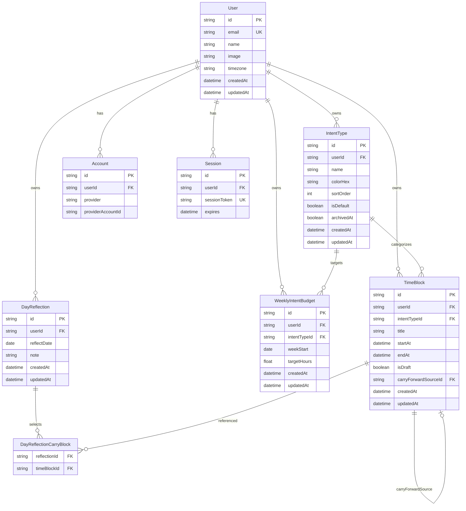

# ER Diagram

# Initial Data
## IntentType
Seeded per new user on first login (application logic, not global table rows):
- name: Deep Work, colorHex: #4F46E5, sortOrder: 0, isDefault: true
- name: Recovery, colorHex: #10B981, sortOrder: 1, isDefault: true
- name: Connection, colorHex: #F59E0B, sortOrder: 2, isDefault: true
- name: Admin, colorHex: #6B7280, sortOrder: 3, isDefault: true
- name: Uncategorized, colorHex: #9CA3AF, sortOrder: 99, isDefault: true, archivedAt: false (system, non-deletable)

## User
- timezone: UTC (default until user changes in future settings)
